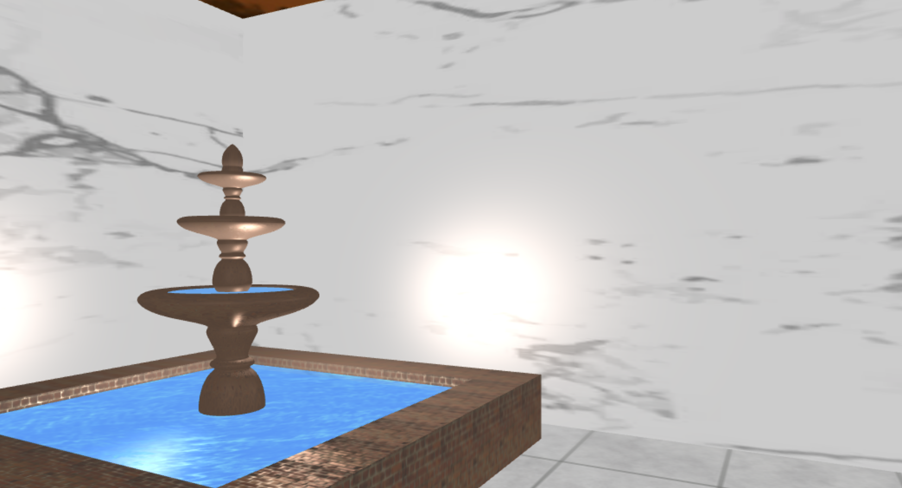
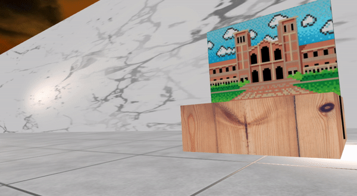
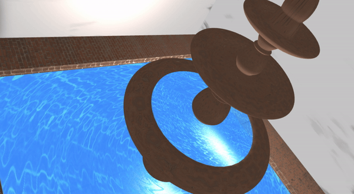
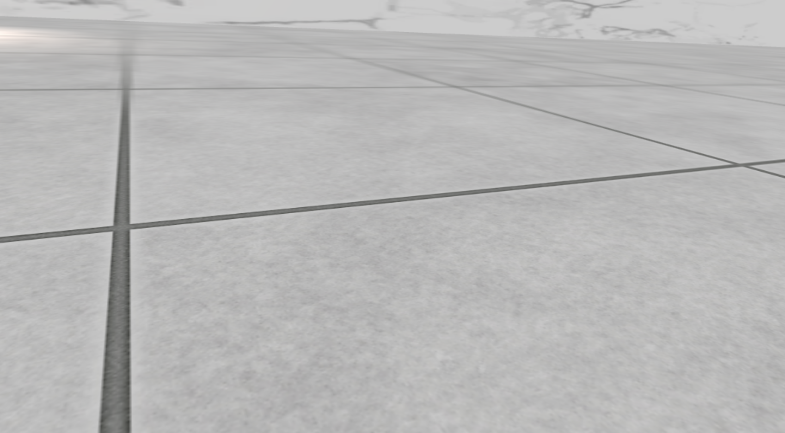
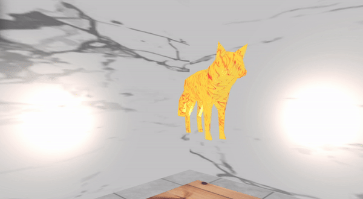

# hotncold

```hotncold``` is a showroom for texture mappings made with ```tiny-graphics```.


Final Project for CS174A - team stone

```Makers```: Francesco Colonnese & Austin Eral

## About

Our project showcases several forms of texture mapping. 
In specific, we use Bump Mapping to create dynamic lighting effects on objects, with the aim of creating textures that change over time to simulate fluid dynamics and 2-dimensional animations within our scene.

## Advanced Features

Our project is composed of several advanced features. In specific, we focused on: 

- ```bump mapping```: a technique to make it seem like low-poly models are actually high-poly. 
- ```animated textures```: through the use of tiny graphics, we were able to animate our scene by dinamically loading textures while rendering. 

### Bump Mapping



Our bump mapping works by using the original texture that is mapped to an object using a Phong Texture Shader to translate the normals of pixels in the fragment shaders. This gives the illusion that the object is multi-poly and not flat.

### Animated Textures



By creating an array of textures for an object, we can reassign textures to the object over time. We split videos and gif animations into their frames for each texture since glsl does not support animated gif texture rendering.

## Explore
### Fountain



The fountain uses both advanced features to simulate the reflectivity of moving water and how its surface appears to change over time.

### Marble Floor



The marble floor uses a bump mapped texture that is rescaled over the object to create the appearance of more tiles.

### Sky sphere (box)


The sky is a large sphere with a circular panoramic image mapped to the object. This avoids the visible issue where the texture meets the other side of itself. The sphere is not moving but the texture is rotating across the sphere.

## (Fire) Fox



We decided that animated textures could have been tested in any way, so we decided to create a fox and set its texture animation time to a faster timeframe, to check whether our computers could handle it. The model was imported using an .obj file. 
